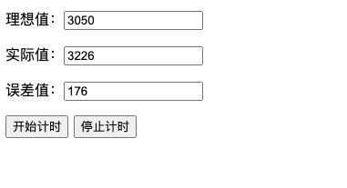
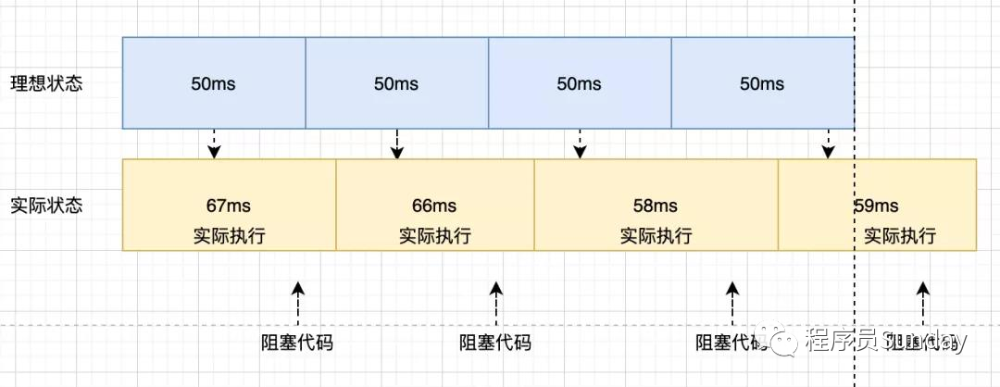
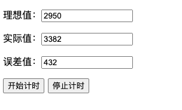
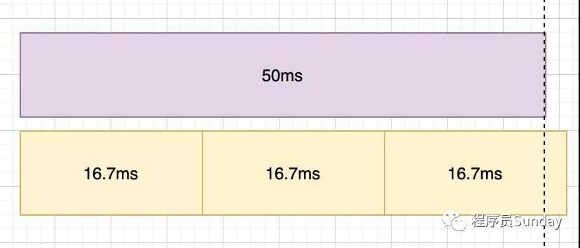
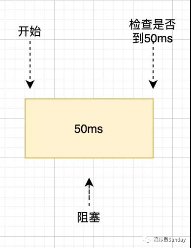
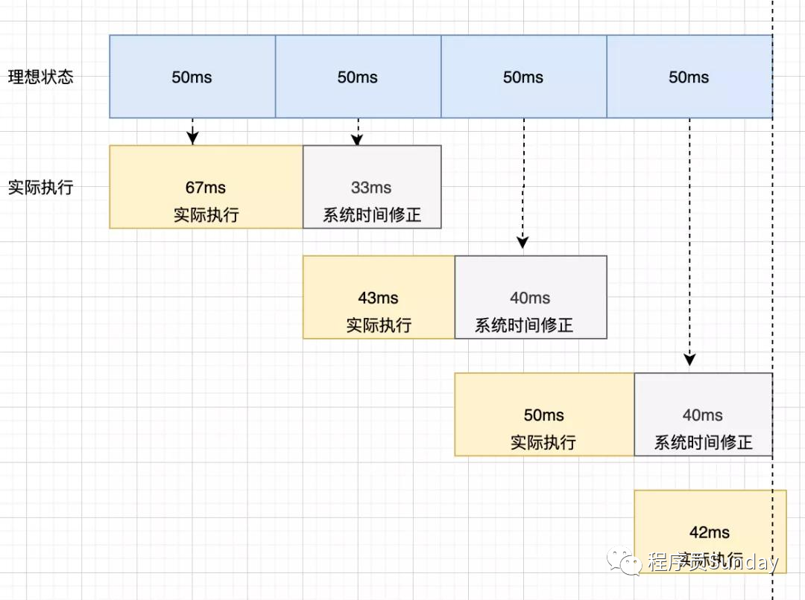

## 准时setTimeout

### setTimeout

可以看到随着时间的推移， setTimeout 实际执行的时间和理想的时间差值会越来越大，这就不是我们预期的样子。类比真实的场景，对于一些倒计时以及动画来说都会造成时间的偏差都是不理想的。

这站图可以很好的描述以上问题：

### requestAnimationFrame 模拟 setTimeout

window.requestAnimationFrame() 告诉浏览器——你希望执行一个动画，并且要求浏览器在下次重绘之前调用指定的回调函数更新动画。
该方法需要传入一个回调函数作为参数，该回调函数会在浏览器下一次重绘之前执行，回调函数执行次数通常是每秒60次，也就是每16.7ms 执行一次，但是并不一定保证为 16.7 ms。
我们也可以尝试一下将它来模拟 setTimeout。

发现由于 16.7 ms 间隔执行，在使用间隔很小的定时器，很容易导致时间的不准确

### while 模拟 setTimeout
想得到准确的，我们第一反应就是如果我们能够主动去触发，获取到最开始的时间，以及不断去轮询当前时间，
如果差值是预期的时间，那么这个定时器肯定是准确的，那么用 while 可以实现这个功能。

理解起来也很简单：

打印：误差 0
显然这样的方式很精确，但是我们知道 js 是单线程运行，使用这样的方式强行霸占线程会使得页面进入卡死状态，这样的结果显然是不合适的。

### setTimeout 系统时间补偿

这个方案是在 stackoverflow 看到的一个方案，我们来看看此方案和原方案的区别
原方案

setTimeout系统时间补偿

当每一次定时器执行时后，都去获取系统的时间来进行修正，虽然每次运行可能会有误差，但是通过系统时间对每次运行的修复，能够让后面每一次时间都得到一个补偿。

